## Вариант 1
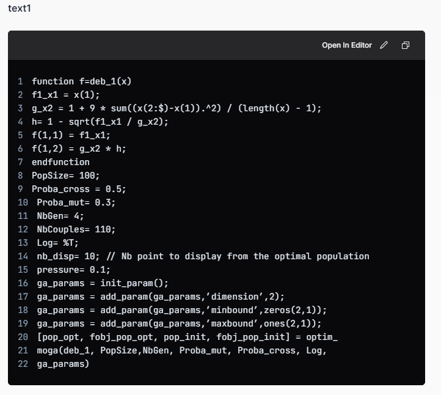

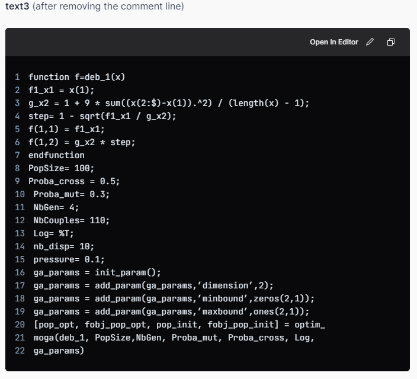

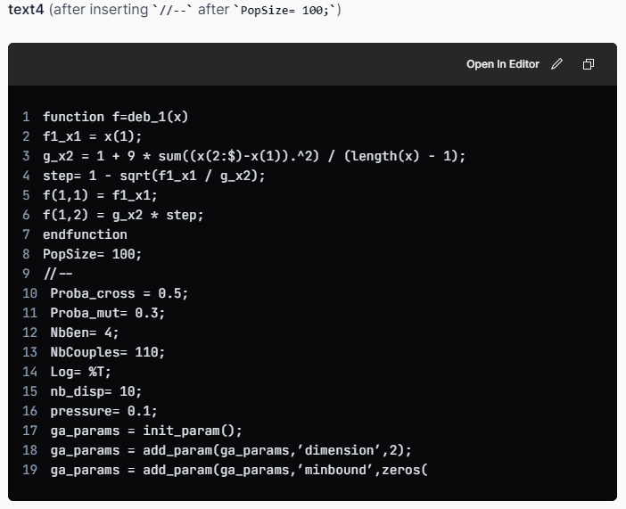

## Вариант 2
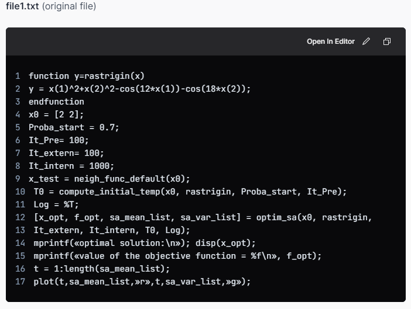

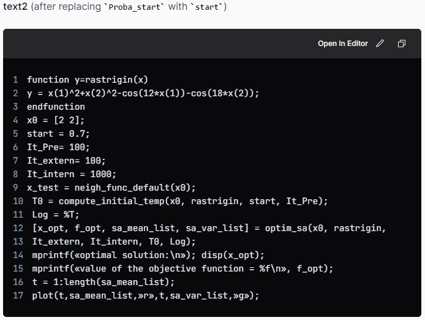

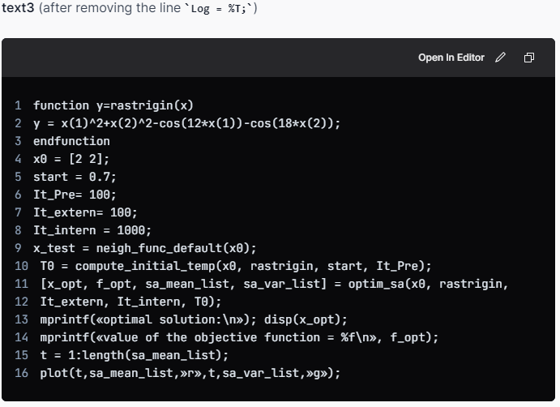

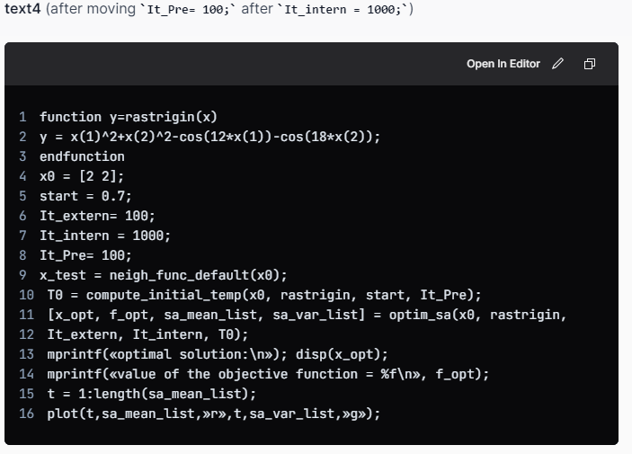

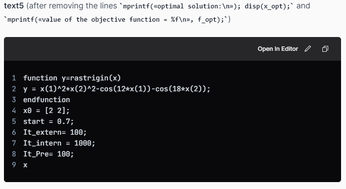

## Вариант 3
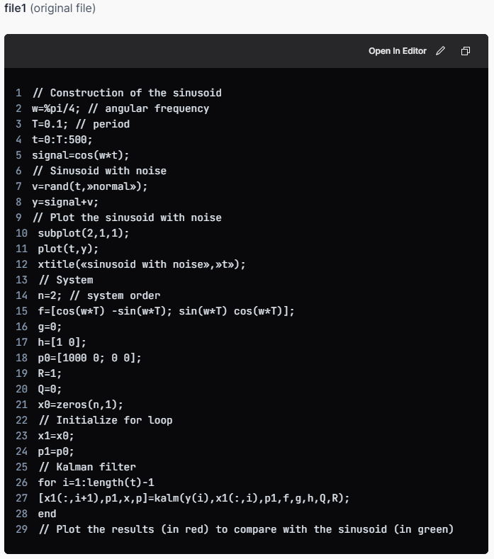

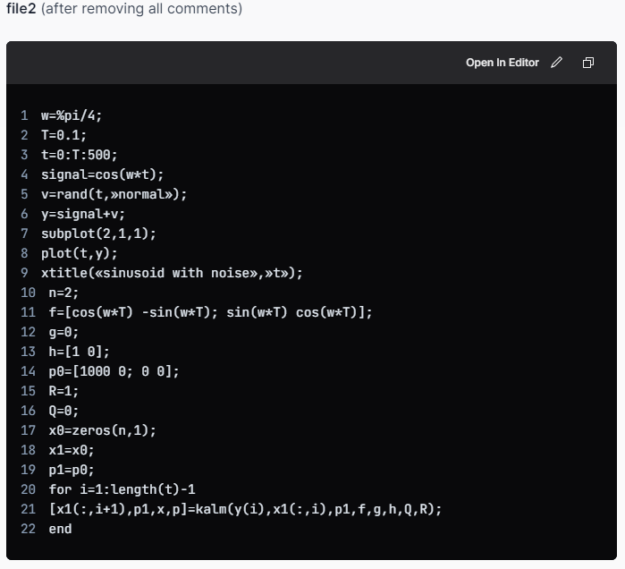

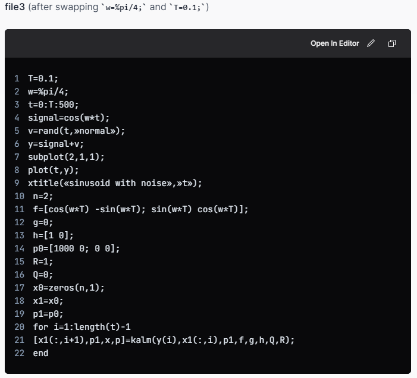

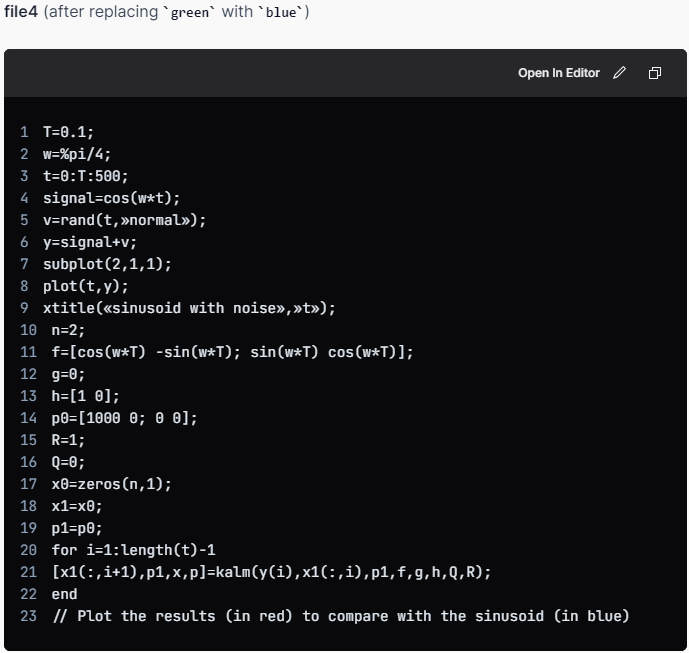

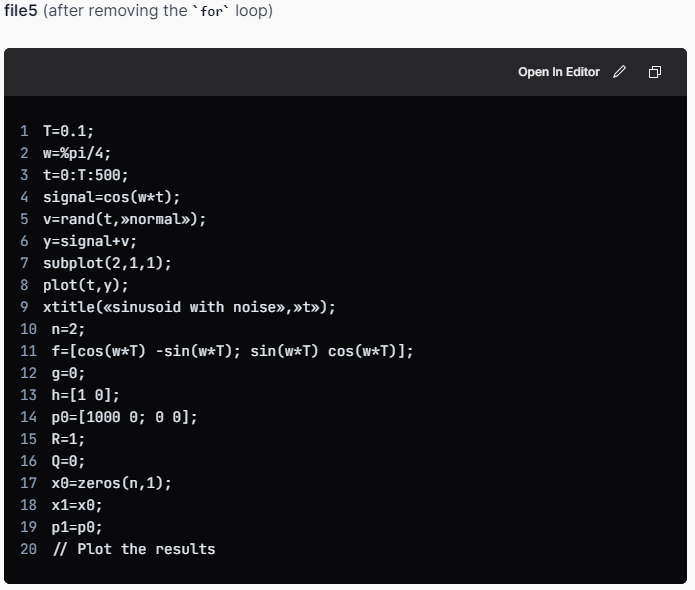

## Контрольные вопросы
### 1. Какие режимы существуют у редактора vi?
В редакторе VI существует всего три режима: командный режим (command mode), режим ввода (insert mode) и режим последней строки (last line mode).
### 2. Диаграмма переключения режимов vi.
При запуске редактора vi вы оказываетесь в командном режиме. В этом режиме можно давать команды для редактирования файлов или перейти в другой режим. Например, вводя x в командном режиме мы удаляем символ, на который указывает курсор.

Основной ввод и редактирование текста осуществляется в режиме ввода. При использовании редактора vi основное время, скорее всего, будет проводиться именно в этом режиме. Переход в режим ввода из командного режима осуществляется командой i (от слова insert). Находясь в режиме ввода, можно вводить текст в то место, куда указывает курсор. Выход из режима ввода в командный режим осуществляется клавишей “Esc”.

Режим последней строки - это специальный режим, в котором редактору даются сложные команды. При вводе этих команд они отображаются в последней строке экрана (отсюда пошло название режима). Например, если ввести в командном режиме команду :, то осуществится переход в режим последней строки, и можно будет вводить такие команды, как wq (записать файл и покинуть редактор vi) или q! (выйти из редактора vi без сохранения изменений). В режиме последней строки обычно вводятся команды, название которых состоит из нескольких символов. В этом режиме в последнюю строку вводится команда, после чего нажимается клавиша Enter, и команда исполняется.
### 3. Как получать помощь по использованию vi?
Для этого необходимо:
1. перевести Vi в режим командной строки, нажав «:»;
2. ввести команду help и нажать клавишу Enter.
    - Для того, чтобы закрыть справочную страницу, нужно ввести команду :g.
    - Чтобы ввести текст, необходимо перейти из командного режима в режим вставки, нажав клавишу «i» (insert – вставка).
    - После этого в последней строке появится сообщение о том, что редактор находится в режиме вставки «--INSERT--».
    - В режиме вставки можно вводить текст, завершая строку нажатием клавиши Enter.
    - Чтобы перейти из режима вставки в командный режим, необходимо нажать клавишу «ESC».
### 4. Команды позиционирования курсора и их использование.
Для движения курсора использовать клавиши h, j, k и l. Они будут сдвигать курсор соответственно влево, вниз, вверх и вправо. Команда w перемещает курсор на начало следующего слова; команда b перемещает курсор на начало предыдущего слова. Команда 0 (клавиша ноль) перемещает курсор на начало текущей строки, а команда "Dollar" перемещает курсор в её конец. При редактировании больших файлов вам, возможно, захочется «перелистывать» целые экраны вперёд (т. е. вниз) и назад (вверх); для этого используются команды соответственно Ctrl-F и Ctrl-B. Для того, чтобы переместить курсор в конец файла, используется команда G. Можно также поместить курсор на строку с данным номером; например, команда 10G поместит курсор на строку с номером 10. Для того, чтобы переместить курсор в начало файла, можно использовать команду 1G.Команды движения курсора можно совмещать с другими командами, например, с командами удаления текста. Например, команда d$ удалит все, что находится между текущим положением курсора и концом строки; команда dG удалит все, что находится между текущим положением курсора и концом файла и т. д.

Команды позиционирования курсора:
- 0 («ноль») - в начало текущей строки;
- ^ - в начало текущей строки (к первому непробельному символу);
- $ - в конец текущей строки;
- w - на слово вправо;
- b - на слово влево;
- W - до пробела вправо;
- B - до пробела влево;
- } - абзац вниз;
- { - абзац вверх;
- gg - перейти в начало файла;
- G - перейти в конец файла;
- G - перейти на конкретную строку ;
- / - перейти к ;
- ? - то же самое, но искать назад;
- n - повторить поиск;
- N - повторить поиск назад;
- [[ - в начало функции;
- '' - к месту выполнения команды [[
### 5. Команды вставки.
Существует множество способов перехода в режим вставки,но в большинстве случаев оказывается вполне достаточным использование команды i.
- i - переход в режим вставки. Курсор перед символом.
- a - переход в режим вставки. Курсор после символа.
- I - переход в режим вставки. Курсор перед первым не пустым символом строки.
- A - переход в режим вставки. Курсор после последнего непустого символа строки.
- o - переход в режим вставки, начиная с новой строки под текущей позицией курсора.
- O - переход в режим вставки, начиная с новой строки над текущей позицией курсора.
### 6. Команды изменения.
- C - удаление всего, что следует после курсора, до конца строки, затем осуществляется переход в режим вставки.
- c{motion} - удаление текста, начиная с символа после курсора в соответствии с аргументом motion, затем происходит переход в режим вставки.
- {N}s - изменение (замена) следующих N символов, начиная с текущего положения курсора. Команда аналогична команде c, за тем исключением, что вместо команды перемещения здесь указывается точное количество символов, например 5s.
- S - изменение (замена) текущей строки полностью. Удаляет весь текст текущей строки и выполняет переход в режим вставки.
- 2cw - удаление двух слов и переход в режим вставки; альтернативный вариант – удаление двух следующих слов.
- cta - удаление всего вплоть до следующего появления буквы «а» с последующим переходом в режим вставки. Является комбинацией команды c и команды перемещения ta.
- 5cta - удаление всего вплоть до пятого появления буквы «а» с последующим переходом в режим вставки.
- 5S - удаление текущей строки и последующих 4 строк с последующим переходом в режим вставки.
### 7. Команды вырезания, вставки и удаления.
- D - удаление всего, начиная с текущего положения курсора до конца строки. Данные сохраняются в буфере по умолчанию.
- d{motion} - удаление определенного количества символов, начиная с текущего положения курсора. Количество символов определяется аргументом motion. Для удаления текущей строки надо вводить dd. Данные сохраняются в буфере по умолчанию.
- y{motion} - копирование определенного количества символов в регистр. Количество символов определяется аргументом motion. Для копирования текущей строки в буфер обмена надо вводить yy.
- p - вставка (помещение) в буфер символов, начиная с символа, следующего за символом возле курсора.
- P - вставка (помещение) в буфер символов, начиная с символа, находящегося перед символом возле курсора.